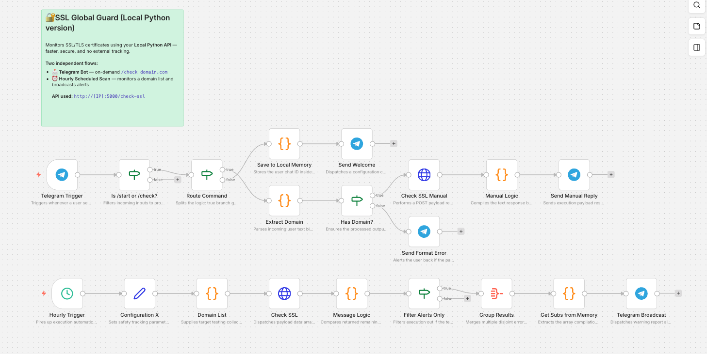
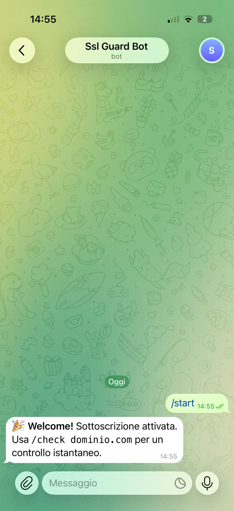

# SSL Global Guard 🛡️


**SSL Global Guard** is a lightweight Python monitor that checks whether a website is reachable and whether its SSL certificate is valid and close to expiration.

It solves a simple but critical problem: expired certificates and broken websites are often discovered too late. With a CLI mode and a Flask API endpoint, SSL Global Guard can be used locally, integrated into automation tools such as n8n, or connected to your own monitoring workflows.

## ✨ Key Features

- 🔐 **SSL certificate validation** with exact remaining days and expiration date.
- 🌐 **Website availability check** before validating the certificate.
- 🚨 **Clear failure responses** for offline websites, invalid URLs, HTTP errors, and expired certificates.
- ⚡ **Dual usage mode**: run it from the command line or expose it as a local Flask API.
- 🔁 **Automation-friendly JSON output** designed for workflow tools such as n8n.

## 📸 Screenshot / Demo

> Replace or extend these placeholders with your final dashboard, workflow, or terminal demo.






## 🚀 Installation

### 1. Clone the repository

```bash
git clone https://github.com/your-username/ssl-global-guard.git
cd ssl-global-guard
```

### 2. Create and activate a virtual environment

```bash
python3 -m venv .venv
source .venv/bin/activate
```

On Windows:

```bash
python -m venv .venv
.venv\Scripts\activate
```

### 3. Install dependencies

```bash
pip install -r requirements.txt
```

## ⚙️ Usage

### Run a quick SSL check from the CLI

```bash
python main.py example.com
```

Example output:

```text
avvio controllo cli per: example.com
---
status: success
url: example.com
ssl_valido: True
giorni_rimanenti: 120
data_scadenza: 13/09/2026
messaggio: certificato ssl valido e verificato
```

### Start the local Flask API

```bash
python main.py
```

The server will start at:

```text
http://localhost:5000
```

### Check a website via API

```bash
curl -X POST http://localhost:5000/check-ssl \
  -H "Content-Type: application/json" \
  -d '{"url": "example.com"}'
```

Example JSON response:

```json
{
  "status": "success",
  "url": "example.com",
  "ssl_valido": true,
  "giorni_rimanenti": 120,
  "data_scadenza": "13/09/2026",
  "messaggio": "certificato ssl valido e verificato"
}
```

### Example failure response

```json
{
  "status": "failed",
  "url": "invalid-domain.test",
  "ssl_valido": false,
  "giorni_rimanenti": -1,
  "data_scadenza": "N/D",
  "messaggio": "❌ il sito è offline o l'url è inesistente"
}
```

## 🧰 Technologies Used

- **Python** - core application logic.
- **Flask** - lightweight HTTP API server.
- **socket** and **ssl** - native SSL certificate inspection.
- **urllib** - website availability checks.
- **certifi** - trusted certificate authority bundle support.
- **n8n-ready JSON workflow** - optional local automation integration.

## 🗺️ Roadmap

- [ ] Add configurable warning thresholds for certificates expiring soon.
- [ ] Add email, Slack, Telegram, or Discord alert examples.
- [ ] Provide a Dockerfile for containerized deployments.
- [ ] Add automated tests for CLI and API behavior.
- [ ] Add GitHub Actions for linting and test checks.
- [ ] Improve response localization and offer English/Italian message templates.

## 🤝 Contributing

Contributions are welcome and appreciated.

To contribute:

1. Fork the repository.
2. Create a new branch:

```bash
git checkout -b feature/your-feature-name
```

3. Make your changes and commit them:

```bash
git commit -m "Add your feature"
```

4. Push your branch:

```bash
git push origin feature/your-feature-name
```

5. Open a Pull Request with a clear description of your changes.

Before submitting, please make sure your code is focused, readable, and easy to review.

## 📄 License

This project is licensed under the **MIT License**.

You are free to use, modify, and distribute it according to the terms of the license.

